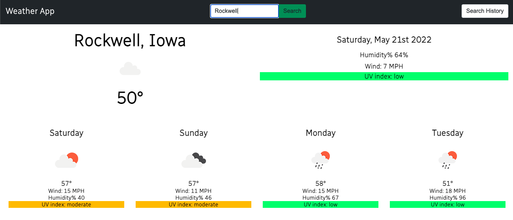

# Weather-App

Weather App is a lightweight and simple single page application to view the weather anywhere in the world. 

## Features
- **Instant Search Results**
- **Revisitable Past Searches**
- **Color Coded UV Index**

### Tech used
This weather app was built using the following:
- HTML 5, Javascript ES6, CSS 3
- jQuery
- jQuery UI
- Open Weather API

### Possible Future Improvements
* improve search functionality to better handle cities in multiple locations
* improve city name display when it's someplace that doesn't have a state
* flesh out weather data with more information including current moon phase
* change away from the rather uninspired icons proved by open weather to something more stylistic
* leverage the browsers geolocation api to load current location on first visit